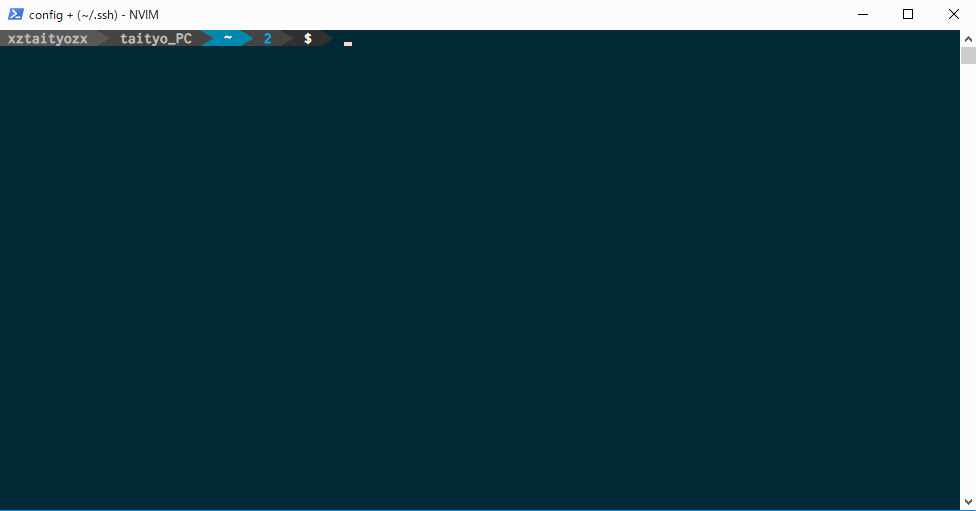

# __cdx__


cdx is hyper cd command.

## __Description__

cdx is wrapper for cd command. cdx can move to directory from history or bookmark, or ssh remote. 

## __Require__
python3  
bash or fish

## __Demo__


## __Install__

`cdx` requires python3. please install python3 before install `cdx`.

```sh
git clone https://github.com/xztaityozx/cdx
cd cdx
./sh/install.sh
```

## __Usage__

```sh
cdx [OPTION] PATH
```

Usage is the same the cd command.

### __Options__

|Option|Action|
|:--:|:--:|
|--help|Show help|
|--cd|Use cd command instead of pushd|
|--ls|ls command automatically executes after change directory|
|-h|cd from history|
|-b|cd from bookmark|
|+b|Add current directory to bookmark|
|-p|Use popd command instead of cd or pushd command|
|--automake|When destination directory is not exists. cdx make directory automatically|
|--make|When destination directory is not exists. cdx asks if you want to make directory|
|--ssh|Allow ssh login when giving cdx a host name in `~/.ssh/config`. If same name directory exists. change directory has priority.|

If you always add options, write options to `CDX_DEFAULT_OPTS`. cdx automatically adds  options.

ex)  
`~/.bashrc`

```sh
...
CDX_DEFAULT_OPTS="--ssh --make"
CDX_FUZZY_COMMAND="fzf"
...
```

## __Release Node__
- 2017/08/23 
  * Support fish shell
  * Mostly all functions ware been rewrote by python.This change is to support for fish shell

# __cdx__

`cdx` は ハイパーな`cd`コマンドです

## __Description__

`cdx`はcdコマンドのラッパースクリプトです。履歴やブックマーク、sshリモートへ移動できます。

## __Usage__

```sh
cdx [OPTION] PATH
```

使い方はcdコマンドと同じです。

### __Options__

|Option|Action|
|:--:|:--:|
|--help|ヘルプを表示します|
|--cd|`cdx`ではデフォルトで`pushd`コマンドを使うようにしていますがこれを`cd`に置き換えます|
|--ls|`cd`した後に自動的に`ls`コマンドを実行します|
|-h|履歴から`cd`します。これには--fuzzyオプションが必要です|
|-b|ブックマークから`cd`します。これには--fuzzyオプションが必要です|
|+b|カレントディレクトリをブックマークに追加します|
|-p|`cd`や`pushd`の代わりに`popd`を実行します|
|--automake|移動先が見つからなかったとき自動的にディレクトリを作り`cd`します|
|--make|移動先が見つからなかったときにディレクトリを作ってもいいか尋ねます|
|--ssh|`cdx`に`ssh`を許可します。これをオンにして`~/.ssh/config`にあるホスト名を与えると`ssh`ログインを試みます。もし同じ名前のディレクトリがある場合は`cd`が優先されます|

設定は`~/.bashrc`にでも書くといいと思います。

```sh
...
CDX_DEFAULT_OPTS="--ssh --make"
CDX_FUZZY_COMMAND="fzf"
...
```

## __License__
[MIT](https://github.com/xztaityozx/cdx/blob/master/MITlicense.txt) (c) xztaityozx
